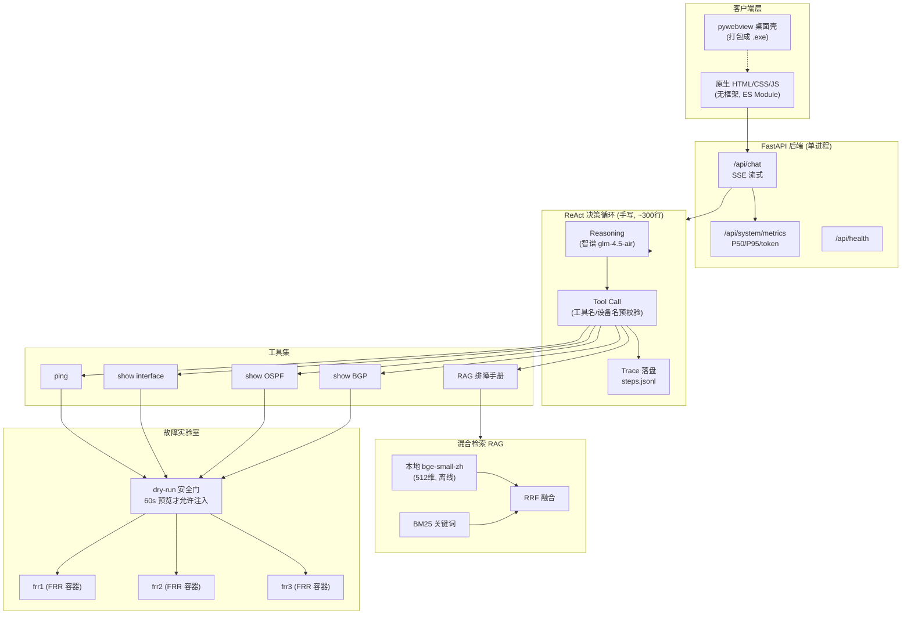

# NetOps AI Assistant

> AI Agent 驱动的网络运维助手：自研 ReAct 决策循环 + 混合检索知识库 + Docker/FRR 真实协议实验室。
> 面向网络故障诊断场景，让大模型能真正读设备状态、注入并恢复故障、再下结论。
>
> 📖 **技术复盘**：[从第一性原理到落地——这个项目是怎么做出来的](docs/项目自述-从第一性原理到落地.md)


---

## 目录

- [这个系统是做什么的](#这个系统是做什么的)
- [核心能力](#核心能力)
- [技术架构与选型理由](#技术架构与选型理由)
- [技术特性与架构边界](#技术特性与架构边界)
- [快速开始](#快速开始)
- [测试](#测试)
- [配置项](#配置项)
- [项目结构](#项目结构)
- [English](#english)

---

## 这个系统是做什么的

这个项目始于一段真实实习经历：2026 年 7 月起，我在中金财富技术部做网络工程师实习生。带我的主管每天要在公司自研的网络管理系统上审批大量网络变更请求——割接、扩容、故障处理、配置变更，每条都要登系统、看设备状态、对照手册、判断能不能批。我坐在他旁边观察了一周，发现这些审批有一个固定套路：**先查多台设备状态取证，再结合排障手册下结论**。这个项目就是为了把这个套路自动化，让主管用一句自然语言就能拿到带证据的回答。

网络运维的日常排障（"接口为什么 down 了""为什么 BGP 邻居起不来""这台交换机和那台路由器之间不通"）有一个共同模式：**先查多台设备的状态取证，再结合排障手册下结论**。传统做法是人登录设备敲 `display`/`show` 命令、翻文档；纯大模型对话的做法是直接生成回答——但后者不知道现场设备的真实状态，容易"一本正经地编"。

NetOps AI Assistant 把这两件事接起来：

1. 用户用自然语言提问（"frr2 的 OSPF 邻居为什么断了"）；
2. 系统的 Agent **不直接回答**，而是像运维工程师一样先调用工具取证——ping、查接口、查 OSPF/BGP 邻居、查排障手册，最多 6 步循环；
3. 工具结果是**真实设备的真实输出**（Netmiko SSH 读到的 CLI，或带外 `docker exec vtysh` 读到的 FRR 路由表）；
4. 取证足够后，大模型基于这些真实输出组织最终回答，并在系统内做了**反幻觉硬约束**：没有工具输出时必须明说"未获取到设备数据"，禁止编造丢包率、端口状态、错误计数。

此外它内置了一个**可逆故障实验室**：在 3 台跑真实 OSPF/eBGP 协议栈的 FRR 容器上注入 `link_down`/`ospf_cost`/`bgp_neighbor_down` 三类故障，观察邻居和路由的真实变化，再一键恢复。这使得"AI 运维"不是对着假数据演示，而是在真协议栈上观察真故障。

适用场景：网络工程排障演练、AI Agent 闭环验证、运维自动化技术评估。

---

## 核心能力

### 1. 自研 ReAct Agent（不依赖 LangChain/LangGraph）

`backend/app/agent/agent.py` 手写了 Reasoning + Acting 循环：

- **决策协议**：系统提示词向模型描述工具列表，模型每步严格输出 JSON：`{"action":"tool","name":...,"arguments":{...}}` 或 `{"action":"finish"}`；
- **多步循环**：工具结果以 `tool` 角色消息回灌，模型继续决策，最多 `agent_max_steps=6` 步；
- **强制取证**：诊断类问题若工具调用少于 3 次就想 `finish`，会被拦截并要求继续取证（带下一步取证方向提示：先 ping → 查接口 → 查邻居/ACL/ARP → 查时间线），由最大步数兜底防死循环；
- **容错解析**：模型输出常有 markdown 围栏、多余前后缀、"思考文字+JSON"拼接，解析器做了三级兜底（整体 JSON → 提取花括号片段 → 用片段前的裸工具名补全）；
- **过程可见**：每一步的原始决策和工具调用结果通过 SSE 实时推到前端，用户能看到模型"先查了什么、再查了什么"；
- **运行轨迹落盘（Agent Trace）**：每次 Agent 运行按 session_id 写 backend/data/traces/<session_id>/steps.jsonl，记录每一步的类型（thought/tool_call/hallucinated_tool/hallucinated_device/finish/error）、LLM 原始决策、工具名与参数、执行耗时（ms）、结果预览、总耗时，结束时再写一份 summary.json。这使得"模型为什么这步调了这个工具"可复盘，而不是跑完即焚；
- **工具名/设备名幻觉前置拦截**：LLM 输出的工具名若不在注册表中、设备名若不在 devices.json 中，在真正发起 SSH 之前就回灌纠正（"你调用了不存在的工具 X，可用工具是 [...]"），最多重试 2 次。相比"发了命令再 catch 异常"，这把幻觉挡在设备操作层之外。

### 2. 工具注册表与权限

`backend/app/agent/tools.py` 用 `@register_tool` 装饰器自动收集工具，新增工具只需写一个 async 函数，无需改调度逻辑。当前 6 个工具：

| 工具 | 作用 | 允许角色 |
|---|---|---|
| `run_device_command` | 在设备上执行 CLI | operator/admin |
| `ping` / `traceroute` | 连通性测试 | operator/admin |
| `search_runbook` | 检索排障知识库 | viewer/operator/admin |
| `get_event_timeline` | 故障事件时间线 | operator/admin |
| `frr_fault_inject` | FRR 故障注入/恢复/带外查看 | admin |

命令注入做了**二道防线**：`_guard_cli` 在工具入口拒绝 shell 元字符（`&&`、`|`、`;`、`$()`、反引号等），`frr_lab._run` 在执行前再拦一次。

### 3. 混合检索 RAG

`backend/app/rag/retrieval.py` 实现了完整的混合检索管线：

- **自研 BM25**（不引 jieba/rank_bm25）：中文按 CJK 单字 + 相邻二元组切分，英文按词切分，k1=1.5、b=0.75；
- **向量检索**：本地 `bge-small-zh-v1.5`（CPU，512 维），向量库存于 `vectors.npy` + `meta.json`；
- **RRF 融合**（Reciprocal Rank Fusion，k=60）合并词法与语义两路候选；
- **口语→术语查询扩展**：把"时通时断/掉线/抓包/带宽打满"等口语映射为 `flapping`/`DHCP`/`端口镜像`/`拥塞` 等标准术语，缓解词面差异；
- **告警路由加权**：确定性告警规则命中的手册在 RRF 分上叠加 boost，不替代检索而是加权；
- **文档级去重**：同一来源只保留最高分 chunk，避免同文档多 chunk 霸榜；
- **Rerank 评测驱动**：代码里保留了智谱 rerank 接入，但用领域查询做过离线评测——通用 rerank 在本领域是负优化（权重 0.4 时 MRR 0.566，0.2 时 0.693，纯 RRF 0.891），因此 `rerank_weight` 默认 0。这是用数据调参而不是堆组件。
- **检索质量可量化（Recall@5 / MRR）**：`backend/app/rag/evaluate.py` 内置 96 条标注评测集（每条期望命中文档，按 standard/colloquial/terse/noisy/shorthand 五种真实问法分组），一键跑：`python -m app.rag.evaluate`。当前线上 hybrid 配置（BM25+向量+RRF）实测 **Recall@5=0.990（95/96）、MRR=0.748**；纯向量基线 R@5=0.865/MRR=0.680。最弱变体是口语化工单（colloquial MRR=0.50），已在 `tests/test_eval_smoke.py` 加静态校验防标注漂移。

### 4. FRR 真实协议实验室（方案 B）

`backend/app/agent/frr_lab.py` + `docker-compose.frr.yml`：

- 3 个 Docker 容器跑 FRR（Free Range Routing），frr1↔frr2 跑 OSPF，frr2↔frr3 跑 eBGP，构成真实路由邻接；
- **双通道运维模型**（对齐真实机房实践）：
  - 前台管理通道 = Netmiko SSH（`run_device_command` 读状态）；
  - 带外通道（Out-of-Band）= `docker exec vtysh`，类比 console/ILO——专门用于**会切断管理链路本身的故障**（`shutdown eth0` 同时断了 SSH，此时只能带外执行命令恢复）；
- 3 类可逆故障，每类都有 apply/recover/verify 三段命令链，恢复幂等：
  - `link_down`：接口 shutdown → 邻居 down、路由撤销；
  - `ospf_cost`：cost 调到 10000 → SPF 重选路径；
  - `bgp_neighbor_down`：BGP 邻居 shutdown → 会话 Idle、前缀停止交换；
- 健康度判定有实测教训：直连路由在接口 shutdown 后仍存在，会掩盖故障，因此健康判定只看**关键协议邻居**（OSPF/BGP 状态），不看直连路由；
- **故障注入 dry-run gate（安全门）**：``frr_fault_inject`` 新增 ``action=dry_run``，返回将执行的 vtysh 命令链、预期邻居/路由影响、逆操作命令，不真执行；随后 ``action=inject`` 会检查 ``fault_state`` 里是否有最近 60 秒内同一 (device, fault, iface) 的 dry-run 记录，没有则直接拒绝并回灌"请先 dry_run"。这把"先预览再动手"做成代码层强制，模型想跳过也跳不过；recover/status/show 不受此门约束（recover 是安全操作、status/show 只读）。

### 5. 安全与工程化

- **提示词注入检测**：`security/injection.py` 用正则分级拦截"忽略之前指令/泄露系统提示词"等模式，high 级直接阻断；
- **RBAC**：Bearer token 映射 viewer/operator/admin 三角色，`viewer` 只读知识库、`admin` 才能注入故障；
- **限流**：`/api/chat` 每 IP 滑动窗口 30 次/分钟；
- **审计**：关键操作写 `backend/data/audit.jsonl`；
- **鲁棒性**：空白消息 422、非法 session_id 优雅处理、异常不向用户泄露栈信息（细节进审计日志）。

### 6. 桌面化与打包

- `launcher.py` 用 **pywebview** 开原生桌面窗口（不是浏览器标签页）；
- **PyInstaller onedir** 打包：故意 `excludes` torch/transformers/sentence_transformers 以控制体积；打包环境无 torch 时 embedding 层自动降级为零依赖的哈希向量，功能不崩；
- windowed 模式（无控制台）对 stdio、`input()`、uvicorn 默认日志做了兜底，避免 `sys.stdout is None` 直接崩溃。

---

## 系统架构



**双通道设备访问**：业务通道走 Netmiko SSH（仿真 SSH 服务端）；带外通道走 `docker exec vtysh`（真实 FRR CLI），互为 fallback。

---
## 技术架构与选型理由

```
┌──────────────────────────────────────────────────────────────┐
│  Frontend (frontend/index.html)                              │
│  原生 HTML/CSS/JS · SSE 流式 · 分栏 · 思考过程可视化         │
└──────────────┬───────────────────────────────────────────────┘
               │ HTTP / SSE
┌──────────────▼───────────────────────────────────────────────┐
│  FastAPI (app/main.py) — 10 个路由按功能拆分                 │
├──────────────┬───────────────────────────────────────────────┤
│  ReAct Agent │  RAG Pipeline                    │  Security   │
│  手写循环     │  BM25(自研) + bge向量 + RRF     │  注入/RBAC  │
│  JSON 协议    │  查询扩展 + 告警加权 + 去重       │  限流/审计  │
│  强制取证     │  rerank 评测后默认关闭           │             │
├──────────────┴───────────────────────────────────────────────┤
│  Device Layer                                                │
│  ├── Netmiko SSH → 设备 CLI（前台）                          │
│  └── docker exec vtysh → FRR 容器（带外）                   │
├──────────────────────────────────────────────────────────────┤
│  Docker: frr1 · frr2 · frr3  (OSPF area 0 + eBGP)           │
└──────────────────────────────────────────────────────────────┘
```

| 决策点 | 选择 | 为什么不选其他 |
|---|---|---|
| Agent 框架 | **手写 ReAct 循环** | LangChain/LangGraph 封装了调度循环，工具调用链不透明，运行时难以定位"模型为什么这步调了这个工具"；手写循环约 300 行，决策协议、容错、强制取证均显式可查，后续要条件分支/并行可在此基础上演进。 |
| Web 框架 | FastAPI + Uvicorn | 原生 async 适配 Agent 的多步异步工具调用，SSE 流式支持好，Pydantic 自带请求校验。 |
| 前端 | **原生 HTML/CSS/JS 单页** | 这个项目交互不复杂（聊天 + 拓扑 + 设置），引入 React/Vue 只会增加构建链和包体；SSE、分栏、轮询原生 API 足够。 |
| LLM | 智谱 GLM-4.5-Air（OpenAI 兼容协议） | 国内可直连、有免费额度；代码里抽象了 `LLM_PROVIDER`，切换豆包只需改配置不改代码。 |
| Embedding | **本地 bge-small-zh-v1.5** | API embedding 按量计费且知识库内容要外传；本地模型 512 维、CPU 可跑、零边际成本。打包版无 torch 时再降级为纯哈希向量，保证功能可用。 |
| 向量库 | **NumpyVectorStore（.npy）** | 单机演示不需要 Qdrant/FAISS 的服务化部署；门面层 `store.py` 保留了后端接口，将来要换 Qdrant 只改配置。 |
| 网络仿真 | **Docker + FRR** | 用户机器没装 EVE-NG/GNS3；FRR 是真实路由协议栈（真 OSPF 邻接、真路由表），容器秒级起停、跨平台，比"脚本模拟设备输出"真实得多。 |
| 桌面壳 | **pywebview** | 同一台机器上 Python 栈统一；Electron 体积上百 MB 且需要 Node 工具链，Tauri 要 Rust。pywebview 调系统 WebView2，最终包体 18.7MB。 |
| 重排（rerank） | **接入但默认关闭** | 60 条领域评测实测通用 rerank 是负优化；保留接入路径，不迷信组件数量。 |

---

## 技术特性与架构边界

### 技术特性

- **协议栈级验证**：故障注入后 OSPF 邻居状态、BGP 会话、路由表变化由 FRR 守护进程（zebra/ospfd/bgpd）真实产生，前端拓扑直接消费 vtysh 文本解析结果，不经过状态模拟层；
- **Agent 闭环可观测**：ReAct 循环、工具 JSON 协议、决策容错、强制取证策略均在 `agent/agent.py` 内显式实现，无框架中间层；每一步的决策原文与工具返回通过 SSE 下发，便于离线复盘；
- **检索权重由离线评测确定**：BM25 / 向量 / RRF / rerank 的候选数与融合权重基于 60 条领域查询的 MRR 评估调参，而非按经验默认；
- **纵深防御**：提示词注入分级拦截、RBAC 工具级授权、滑动窗口限流、审计日志落盘、CLI 参数元字符过滤（入口与执行前双重）；
- **自包含运行**：PyInstaller onedir 打包，无 torch 环境时 embedding 自动降级为哈希向量，不依赖外部向量数据库或消息队列。

### 当前架构边界

- **单进程单实例（有意为之，非缺陷）**：FastAPI 单 uvicorn 进程，所有可变状态（会话 JSONL、fault_state、trace、向量索引）落本地文件系统，关键写路径已加进程内 ``threading.Lock`` 串行化（session_store/fault_state/audit/ratelimit/BM25）。``/api/health`` 暴露 ``process.pid`` 与 ``started_at`` 以明示单 worker。不引入 Redis/PG 是因为这是单机排障演练工具，多副本一致性在这个规模下是过度工程；将来要扩展，状态层接口已在 ``session_store``/``store``/``fault_state`` 三个门面后，换 SQLite/Redis 不动业务代码。
- **推理侧外置**：对话模型与可选 embedding 走智谱 OpenAI 兼容端点，本仓库不含本地推理运行时；
- **受控拓扑规模**：真实设备为 3 台 FRR 容器，故障目录按设备-接口白名单（`_LEGAL`）约束，未做多区域自治系统或跨厂商扩展；
- **注入检测为静态规则**：high/medium 分级基于正则模式，未引入语义级注入判定或工具输出端的二次校验；
- **工程化外扩项未接入**：pytest 在本地执行，未配置 CI/CD 流水线、容器化后端镜像与指标/日志外送。

系统定位为网络运维 Agent 的闭环验证平台：聚焦"LLM 经工具调用操作真实协议栈并对结果负责"这一条链路，上述边界即该验证范围的工程切面。

---

## 快速开始

```bash
# 1. 克隆
git clone https://github.com/LJY20030728/netops-ai-assistant.git
cd netops-ai-assistant

# 2. 后端依赖
python -m venv .venv
.venv\Scripts\activate          # Windows
# source .venv/bin/activate     # Linux/macOS
pip install -r backend/requirements.txt

# 3. 配置
cp backend/.env.example backend/.env
# 编辑 backend/.env，填入 ZHIPU_API_KEY

# 4. 启动
python launcher.py             # pywebview 桌面窗口
# 或只起后端：
cd backend && start_backend.bat
```

要在真实 FRR 上演练故障，需先安装 Docker Desktop，`docker-compose.frr.yml` 会拉起 frr1/frr2/frr3。

## 测试

```bash
cd backend
pytest tests/ -q
```

51 个用例覆盖：意图判定、会话持久化、故障状态机、路由冒烟、命令注入拦截、非法 session_id、空白消息、注入检测、拓扑健康度判定。

## 配置项（backend/.env）

| 变量 | 说明 | 默认 |
|---|---|---|
| `ZHIPU_API_KEY` | 智谱 API Key | 空 |
| `ZHIPU_MODEL` | 对话模型 | glm-4-flash（.env 可改 glm-4.5-air） |
| `LLM_PROVIDER` | zhipu / doubao | zhipu |
| `ZHIPU_EMBEDDING_MODEL` | bge / local / embedding-3 | bge（本地） |
| `DEVICE_MODE` | real / simulate | simulate |
| `LLM_MOCK` | 无 Key 时模拟回复 | false |

## 项目结构

```
netops-assistant/
├── backend/
│   ├── app/
│   │   ├── main.py            # FastAPI 入口（注册 10 个路由）
│   │   ├── routers/           # chat/topology/docker/sessions/sim/alert/events/kb/report/system
│   │   ├── agent/             # ReAct 循环 + 工具注册表 + FRR 实验室 + trace
│   │   ├── rag/               # BM25/向量/RRF 混合检索 + embedding
│   │   ├── llm/               # LLM provider 抽象（智谱/豆包）
│   │   └── security/          # 注入检测/RBAC/限流/审计
│   ├── knowledge_base/       # 排障手册语料
│   └── tests/                # pytest（51 用例）
├── frontend/
│   ├── index.html            # 单页应用（HTML 结构）
│   ├── styles.css            # 独立样式（纳西妲绿白主题）
│   ├── js/app.js             # 原生 ES module（聊天/拓扑/会话/时间线）
│   └── assets/               # 图标与主题素材
├── docker-compose.frr.yml    # 3 台 FRR 容器
├── launcher.py               # pywebview 桌面启动器
└── start_backend.bat         # Windows 一键启动
```

---

## English

NetOps AI Assistant is an AI-agent copilot for network troubleshooting. Rather than answering from parametric memory, its hand-written ReAct loop drives an LLM to **collect evidence from real devices** (Netmiko CLI / out-of-band `docker exec vtysh`) before concluding. A three-container FRR lab runs real OSPF + eBGP, and the agent can inject and recover reversible faults (`link_down` / `ospf_cost` / `bgp_neighbor_down`) while observing genuine neighbor and route changes.

Every Agent run writes a JSONL trace under `bbackend/data/traces/<session_id>/` (thoughts, tool calls, latency, hallucinated-tool/device rejections, final summary), and hallucinated tool or device names are rejected before any SSH command is sent. The retrieval layer combines a from-scratch BM25 (CJK unigram+bigram tokenization), local `bge-small-zh` embeddings, and RRF fusion, with query expansion and alert routing. A 60-query domain evaluation drove the decision to keep the third-party reranker disabled (it was a net negative). A security layer adds prompt-injection heuristics, three-role RBAC, rate limiting, and an audit trail.

The stack is intentionally dependency-light: no LangChain/LangGraph, no Qdrant server, no Node build chain. The desktop shell is pywebview, packaged with PyInstaller; when torch is absent the embedding layer degrades to a hash vector so the build stays small. The system implements the closed loop of LLM tool-use against a real routing stack, scoped to a single node.

### License

MIT
